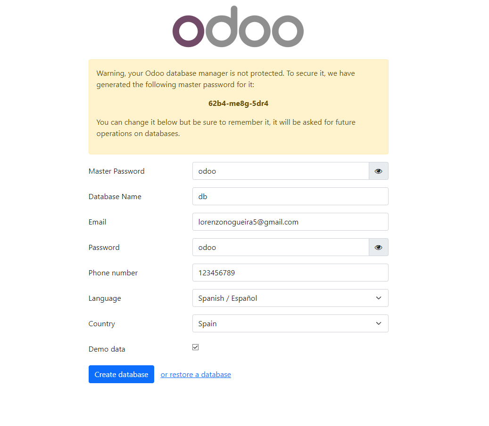
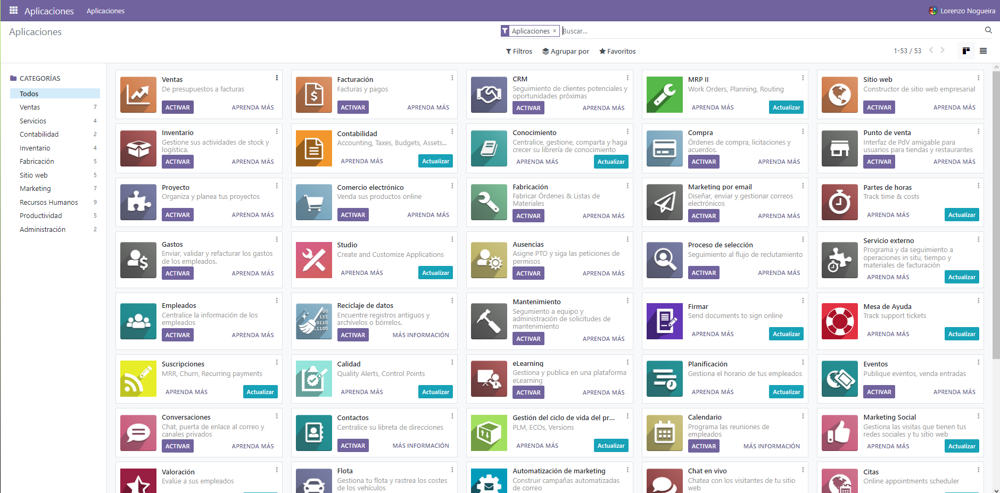
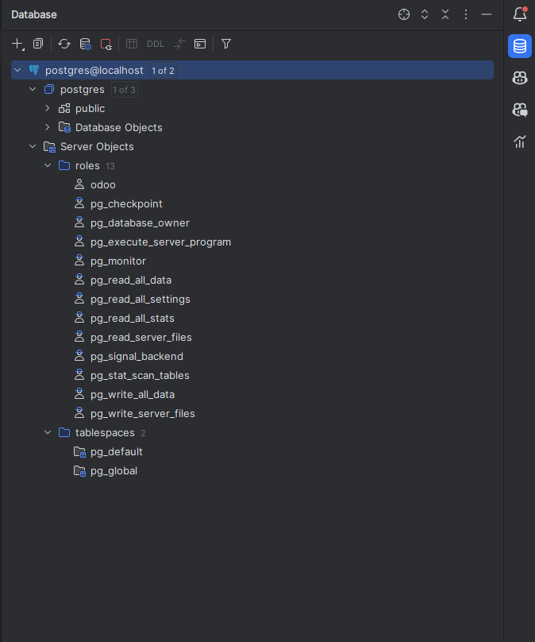

# INSTALACION ODOO


Este es un archivo `docker-compose.yml` que define dos servicios: `web` y `mydb`.

```dockercompose
version: '3.1'
services:
  web:
    image: odoo:16.0
    depends_on:
      - mydb
    ports:
      - "8069:8069"
    environment:
      - HOST=mydb
      - USER=odoo
      - PASSWORD=myodoo
  mydb:
    image: postgres:15
    environment:
      - POSTGRES_DB=postgres
      - POSTGRES_PASSWORD=myodoo
      -

 POST

GRES_USER=odoo
    ports:
      - "5432:5432"
```

**Servicio `web`:**

- Usa la imagen `odoo:16.0`.
- Depende del servicio `mydb`, lo que significa que `mydb` se iniciará antes que `web`.
- Mapea el puerto 8069 del contenedor al puerto 8069 del host.
- Define variables de entorno para la configuración de la base de datos.

**Servicio `mydb`:**

- Usa la imagen `postgres:15`.
- Define variables de entorno para la configuración de la base de datos.
- Mapea el puerto 5432 del contenedor al puerto 5432 del host.

Si el puerto 5432 en tu máquina local ya está en uso, obtendrás un error al intentar iniciar el contenedor de Docker porque Docker no podrá mapear el puerto 5432 del contenedor al puerto 5432 de tu máquina local.

Para solucionar este problema, puedes hacer una de las siguientes cosas:

1. Cambia el puerto en el archivo `docker-compose.yml`. Por ejemplo, podrías cambiar `"5432:5432"` a `"5433:5432"`. Esto mapeará el puerto 5432 dentro del contenedor al puerto 5433 en tu máquina local.

```dockercompose
mydb:
  image: postgres:15
  environment:
    - POSTGRES_DB=postgres


    - POSTGRES_PASSWORD=myodoo
    -GRES_USER=odoo
  ports:
    - "5433:5432"
```

2. Si el puerto 5432 está siendo utilizado por otro servicio en tu máquina local, puedes intentar detener ese servicio para liberar el puerto. Esto dependerá de qué servicio esté utilizando el puerto y cómo se esté ejecutando ese servicio.

Recuerda que después de hacer estos cambios, necesitarás reiniciar tus contenedores de Docker para que los cambios surtan efecto.

En resumen, este archivo `docker-compose.yml` está configurado para ejecutar una aplicación Odoo con una base de datos Postgres.


## CONFIGURACION INICIAL ODOO:

---
## ODOO INICIADO:

## DATABASE CONECTADA A PYCHARM:
