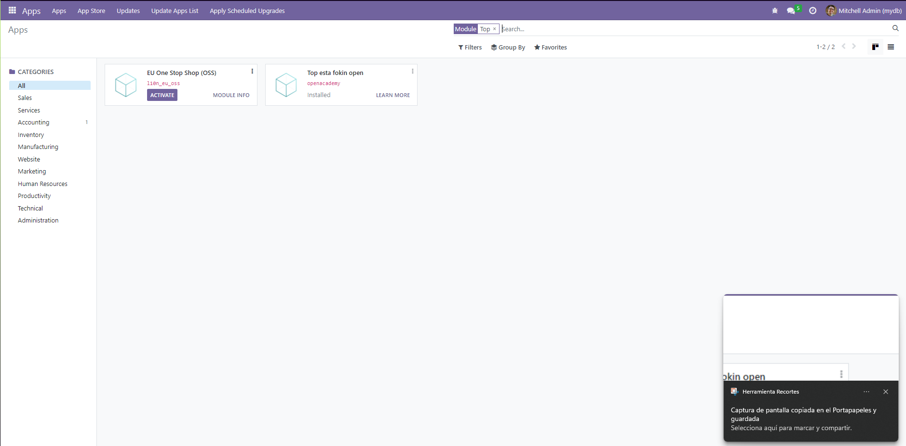
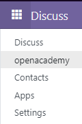
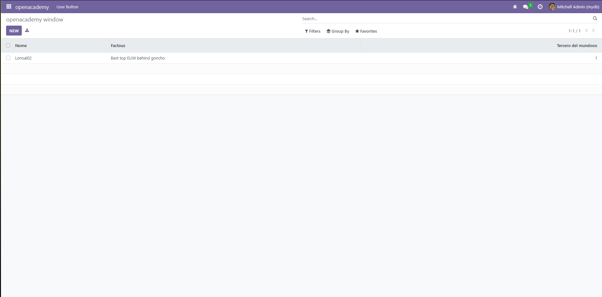

# Como crear addons en odoo

## Crear un modulo
Para crear un modulo primero crearemos una carpeta, en este caso la llamamos `extra-addons`. 
Y la vinculamos en el docker compose con el volumen `extra-addons:/mnt/extra-addons`.
```yaml
services:
  # odoo:
  web_dev:
    image: odoo:16.0
    depends_on:
      - mydb_dev
    volumes:
      - ./extra-addons:/mnt/extra-addons
    ports:
      - "8069:8069"
    environment:
      - HOST=mydb_dev # same name as the postgres service
      - USER=odoo
      - PASSWORD=odoo
```
Ahora tendremos que entrar en la terminal

```bash
docker exec -u root -it nombre_contenedor_odoo-1 /bin/bash;
```
Ahora que estamos dentro del contenedor de odoo, vamos a la carpeta de addons
```bash
cd /mnt/extra-addons/
```
En el siguiente paso crearemos un modulo, para ello usaremos el comando `odoo scaffold` seguido del nombre del modulo que queremos crear, en este caso openacademy.
```bash
odoo scaffold openacademy/
```
Y para poder modificar el modulo, tendremos que cambiar los permisos de la carpeta del modulo.
```bash
chown -R 777 openacademy/
```

### Modificar el modulo
Una vez creado el modulo lo primero que haremos será cambiar el nombre, la descripcion, el resumen del modulo en el archivo `__manifest__.py`
```python
'name': "openacademy",

'summary': """Este es un modulo de odoo que guarda nombres y descripciones de cosas.""",

'description': """Este es mi modulo de odoo""",

'author': "lonoal",
'website': "https://lonoal.com",
```
tambien podriamos cambiar la version del modulo, esta la cambiaremos todo el rato que  cambiemos algo para poder asegurarnos de que se haya subido correctamente.
```python
'version': '0.1',
```

### Crear un modelo o tabla
Nos dirigimos a la carpeta `models` y podemos cambiarle el nombre al archivo `openacademy.py`. 
Ahora que hicimos eso nos toca modificar el archivo, en este caso con cambiar la clase TestModel nos sirve:
```python
class opentop(models.Model):
    _name = 'opentop'
    _description = 'openacademy.openacademy'

    name = fields.Char(string="Nome", required=True)
    description = fields.Text(string="Factous")
    elo = fields.Integer(string="Tercero del mundooo")

```
En este caso estamos creando una tabla llamada `opentop` con tres campos, uno llamado `name` , otro llamado `description` y otro llamado `elo`.

### Crear una vista
En este paso nos moveremos a la carpeta views y modificaremos el archivo `views.xml`. Y tendremos que descomentar los apartados de debajo de los siguiente puntos:
<details><summary><b>explicit list view definition</b></summary>

    <record model="ir.ui.view" id="openacademy.lista_opentop">
      <field name="name">openacademy list</field>
      <field name="model">opentop</field>
      <field name="arch" type="xml">
        <tree>
          <field name="name"/>
          <field name="description"/>
          <field name="elo"/>
        </tree>
      </field>
    </record>

Cambiando en el apartado `<field name="model">` por el nombre de la tabla que hemos creado, en este caso `opentop`.

Y en el apartado `<tree>` poniendo los campos de nuestra tabla
</details>

<details><summary><b>actions opening views on models</b></summary>

    <record model="ir.actions.act_window" id="openacademy.action_window_opentop">
      <field name="name">openacademy window</field>
      <field name="res_model">opentop</field>
      <field name="view_mode">tree,form</field>
    </record>

Cambiando en el apartado `<field name="res_model">` por el nombre de nuestra tabla, en este caso `opentop`.
</details>

<details><summary><b>Top menu item</b></summary>
Descomentamos el top menu item, menu categories y 1 action 

    <menuitem name="openacademy" id="openacademy.menu_root"/>

    <!-- menu categories -->
    <menuitem name="Menu 1" id="openacademy.menu_1" parent="openacademy.menu_root"/>
    <menuitem name="Menu 2" id="openacademy.menu_2" parent="openacademy.menu_root"/>

    <!-- actions -->
    <menuitem name="List" id="openacademy.menu_1_list" parent="openacademy.menu_1"
              action="openacademy.action_window"/>

Y en este apartado no hace falta cambiar nada.
</details>

### Cambiar el acceso a la vista
Para poder ver nuestra vista tenemos que cambiar el acceso a la vista, 
para ello nos dirigimos a la carpeta `security` y modificamos el archivo `ir.model.access.csv`.
Tenemos que cambiar la linea 2, en este caso la cambiamos a:
```csv
access_openacademy_opentop,openacademy.openacademy,model_opentop_model,base.group_user,1,1,1,1
```
Tenemos que cambiar el `model_openacademy.openacademy` por el nombre de nuestra tabla, en este caso `model_opentop_model`.

Y por ultimo tendremos que ir al archivo `__manifest__.py` y descomentar la siguiente linea:
```python
'data': [
    'security/ir.model.access.csv', # linea a descomentar
],
```

### Instalar el modulo
Ahora que tenemos todo esto cambiaremos la version en `__manifest__.py` y lo subiremos a odoo.
```shell
docker compose up -d
docker compose restart
```
(dependiendo si ya lo tenias lanzado o no)

Nos dirigimos al apartado apps, borramos el filtrado Apps y buscamos open (en mi caso)


Y updateamos el modulo. Ahora si vamos a los 9 puntos de arriba a la izquierda nos deberia salir nuestro modulo `opentop`.
Si le damos click nos deberia llevar a la vista con nuestra tabla.:




Desde esta vista podremos modificar los campos de la tabla, añadir nuevos campos, borrar campos, etc.


---